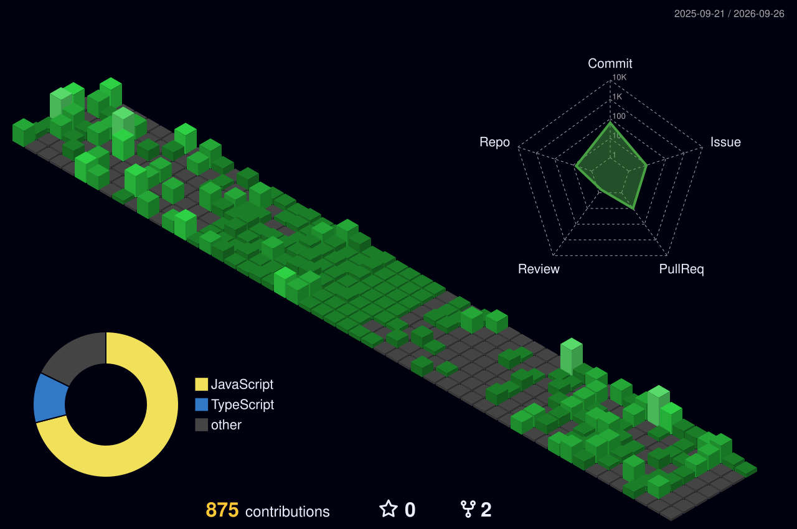

# Yasir Akhlaque 🦇
> *"It's not who I am underneath, but what I build that defines me."*

There's a lot of dysfunctional interfaces out there in the web space. I am here to engineer them a better existence.

I am a full-stack developer who enjoys lurking in the depths of the backend and being in the limelight on the frontend. Nothing but pure architectural design with modern UI.

### 🛠️ The Utility Belt

  
  
  
  
  
  
  
  
  
  
  
  
  
  
  
  
  
  
  
  
  
  
  
  
  
  
  

### 📂 The Case Files
*Actual problems, tangible solutions.*

* **[IET-Connect](https://iet-connect.online/)** – A solution driven platform built for solving academic roadblocks.
* **[Job Application Tracker](https://job-application-tracker-mauve-pi.vercel.app/)** – An attempt at organizing the madness of the job search process.
* **[Luxe-Ecommerce](https://next-ecom-alpha-hazel.vercel.app/)** – High performance and modern digital store front.

### 📍 Directives in Effect

* Developing scalable web applications as a Next.js Developer at EnhanceAI.
* Pursuing my BE in Computer Science along with production grade coding.
* Keeping the open-source community neat and tidy (SWoC '25 & Hacktoberfest '25 Veteran, 40+ PRs merged).

### 📊 The Batcomputer

  

### 📡 Signal The Bat
Got a complex problem to solve, an idea to launch or just want to talk tech, send up the signal.

*   **Headquarters:** [yasirdev.in](https://yasirdev.in)
*   **Comms Link:** [LinkedIn](https://www.linkedin.com/in/yasirakhlaque)

###
## Activity Grid 🌟

