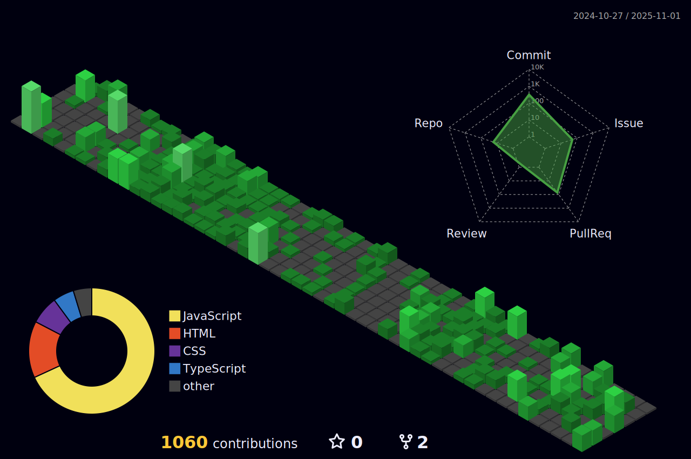

   <!--this is a heading-->
<h1 align="left">Hey 👋 What's up?</h1> 

### 

Hello world! 👋 I'm Yasir Akhlaque, I’m a Frontend Developer who loves building fast, scalable and user-focused web applications.  
I work mainly with React.js, Next.js, TypeScript, Prisma, and modern backend tools.

💡 What I’m good at:
• Building complete full-stack apps (Auth, CRUD, dashboards)  
• Implementing secure authentication (NextAuth, credentials, Google OAuth)  
• Creating responsive UIs with reusable React/Next components  
• Working with REST APIs and databases (MySQL, MongoDB)

🌱 Open Source:
Contributor at SWoC & Hacktoberfest (2024–25).  
Actively contributing to beginner-friendly and real-world repositories.

🎯 Current goal:
Building strong real-world projects and looking for impactful frontend/full-stack internship opportunities.💻

###

<h2 align="left">About me</h2>

###

✨ Creating bugs since 2023 📚 Learning Web Development 🎯 Goals : Be the best   🎲 Fun fact : creating bugs is my hobby 😜

###

<h2 align="left">Languages and Tools I Use:</h2>

###

  
  
  
  
  
  
  
  
  
  
  
  
  
  
  
  
  
  
  
  
  
  
  
  
  
  
  

###

###

 
  
  

###

 

###

  

###

  

###

## My GitHub Contribution Calendar in 3D 🌟

<!---
yasirakhlaque/yasirakhlaque is a ✨ special ✨ repository because its `README.md` (this file) appears on your GitHub profile.
You can click the Preview link to take a look at your changes.
--->

